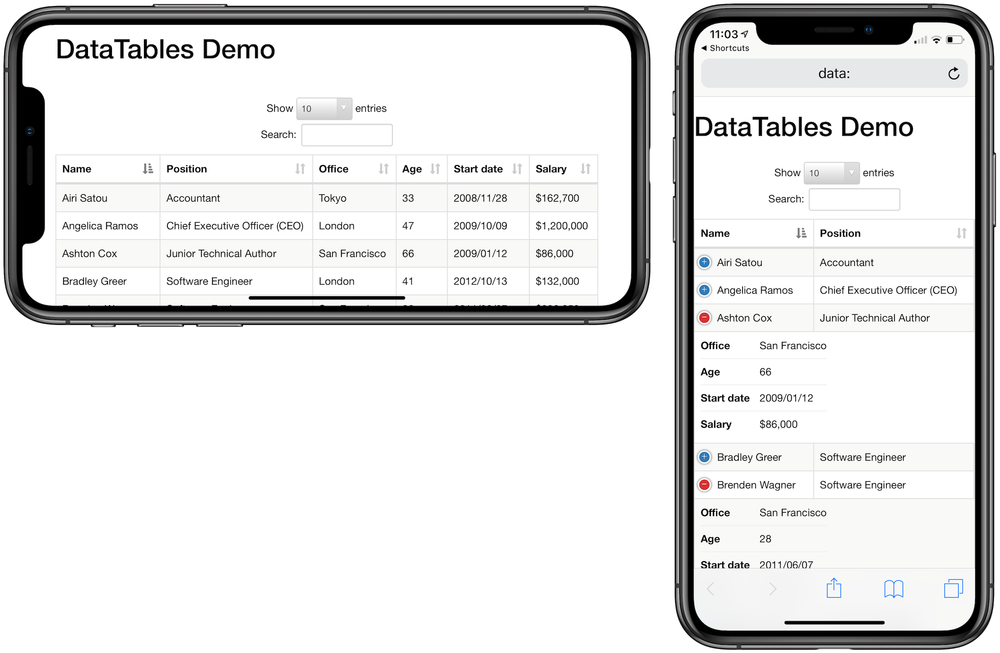

# Tables

## ShowTable 
CSV, HTML, or Markdown results shown as a responsive table
Show tables by sending in simple data in one of several formats.

INPUT
```
- Process: ShowTable
- Title: (optional) Title to be shown on the QuickView window.
- Text: (required) Text containing the HTML or Markdown to be displayed
- Type: (required) HTML/Markdown/CSV
  - HTML Table
  - Markdown Table
  - CSV Table accepts simple csv eg
      - column1,column2,column3,column4 
      - 123,234,2342,232
      - 34,234,23423,2342 
```

OUTPUT

Outputs the html created


## DataTables
CSV or HTML table, sortable, searchable, responsive, paging. DataTables can be used for showing larger amounts of data 




INPUT
```
- Process: DataTables
- Text: (required) Text containing HTML/CSV
- Title: (optional)
- View: (optional) Selecting Safari will open in Mobile safari this is so people with non max screens can use landscape view to fit more columns on the screen.
```

OUTPUT

Generated html file, or Data URL
