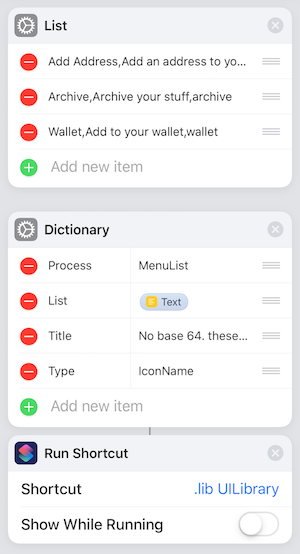

# UILibrary

## What is it?
UILibrary is a libary of routines in one Shortcut to be called from your own Shortcuts. It aims to help you quickly add functionality to any of your Shortcuts.
You can find the Shortcut on routinehub [https://routinehub.co/shortcut/2145](https://routinehub.co/shortcut/2145)

## Demos
- [Demo](https://www.icloud.com/shortcuts/4070691907eb47aba8fd034f2b8c671a) 
- [Demo2](https://www.icloud.com/shortcuts/043fe8e172fb4d66b665aa9152b43181)

## Getting Started
In order to use any of the functions in the library you will need to send a Dictionary to a Run Shortcut command. In some cases you may also use a Text Action or a List Action in addition to the Dictionary.

Remember to turn off Show while running, this has two reasons it will improve the stability of the Shortcut, and will allow it to run faster.

Using a List Action in the Dictionary

Using a Text Action in the Dictionary

### Menus
- MenuList
- Choose Shortcut
- ColorPicker
- PercentageBars

### Quickview
- Show Result
- ShowCard
- Show List
- Highlight
- SpeedRead
- Beep
- Icon

### Tables
- ShowTable
- DataTables

